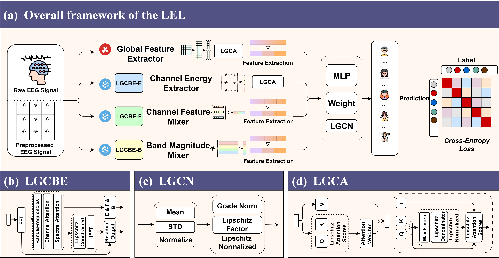

# LEL: A Novel Lipschitz Continuity-constrained Ensemble Learning Model for EEG-based Emotion Recognition

# Overview

LEL is an innovative EEG emotion recognition framework that combines Lipschitz constraints with ensemble learning strategies to enhance model stability and noise resistance, and optimizes decision-making through multi-classifier fusion, thereby significantly improving recognition accuracy. It achieves high accuracy rates of 76.43%, 83.00%, and 89.22% on the EAV, FACED, and SEED datasets respectively, demonstrating excellent performance.



# Key Features

Lipschitz Constraints：Enhance model stability and generalization during training, effectively addressing EEG signal variability while improving robustness and recognition accuracy.
Ensemble Learning Strategy：Leverages the combined strengths of multiple classifiers to reduce overfitting risks and boost the precision and robustness of emotion recognition.
Superior Performance：LEL delivers superior emotion recognition performance across multiple datasets, confirming the framework's effectiveness and generalizability.

# Modules

Lipschitz Gradient-Constrained Band Extraction Component (LGCBE):This module integrates band decomposition, attention mechanisms, and Lipschitz constraints to enhance signal quality and extract key features.
Lipschitz Gradient-Constrained Attention Component (LGCA):This module combines multi-scale local features with global representations using a unique variable window strategy. By doing so, it enables the model to capture fine-grained temporal patterns at different scales while maintaining computational efficiency.
Lipschitz Gradient-Constrained Normalization Component (LGCN):This module normalizes the input and calculates the gradient norm, using a scaling factor λ to keep the gradient within the Lipschitz constant L. This boosts the model's stability and generalization for EEG signal processing.

# Requirements

numpy 2.1.3
torch 2.5.1+cu124
scipy 1.15.1
scikit-learn 1.6.1
matplotlib 3.9.2
tqdm 4.66.2

or choose an appropriate version to use.

# Training & Testing

```
python LEL_main.py
```

# Citation
If you find our codes helpful, please star our project and cite our following papers:

```
@article{gong2025lel,
  title={LEL: A Novel Lipschitz Continuity-constrained Ensemble Learning Model for EEG-based Emotion Recognition},
  author={Gong, Shengyu and Li, Yueyang and Kang, Zijian and Zeng, Weiming and Yan, Hongjie and Siok, Wai Ting and Wang, Nizhuan},
  journal={arXiv preprint arXiv:2504.09156},
  year={2025}
}
```
